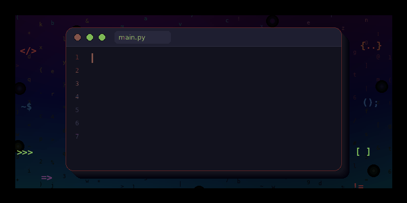

  

## What I do

- **REST APIs and back-end** (.NET, C#, VB.NET)
- **Cross-platform desktop applications** (Free Pascal/Lazarus, Go/Fyne, Delphi)
- **Database connectors and libraries** (.NET 10)
- **System tools and utilities** (Rust, Go, Shell)

## Technical training

Most repositories here are tutorials in French, covering:

- **Databases**: MariaDB, PostgreSQL, SQL Server, MongoDB, Redis, SQLite
- **Languages**: Rust, Go, Python, FreePascal/Lazarus, Delphi, VBA, PowerShell, Bash
- **DevOps**: Docker, MicroK8s/Kubernetes, Git, GitHub CLI
- **Systems**: Linux (Ubuntu, Debian, Mint), server administration
- **Security**: TCP/IP, SSH, PGP/GPG

## Tech stack

.NET (C#, VB.NET) • Delphi • Free Pascal/Lazarus • Go • Rust
REST APIs • Entity Framework • JWT • Docker • Kubernetes
MariaDB • PostgreSQL • SQL Server • MongoDB • Redis

---
### 🔍 Open to work

Currently looking for a **full remote position** as a senior software developer.

📧 ndxdev@gmail.com | 🌐 [deoux-pro.com](https://deoux-pro.com)

---

